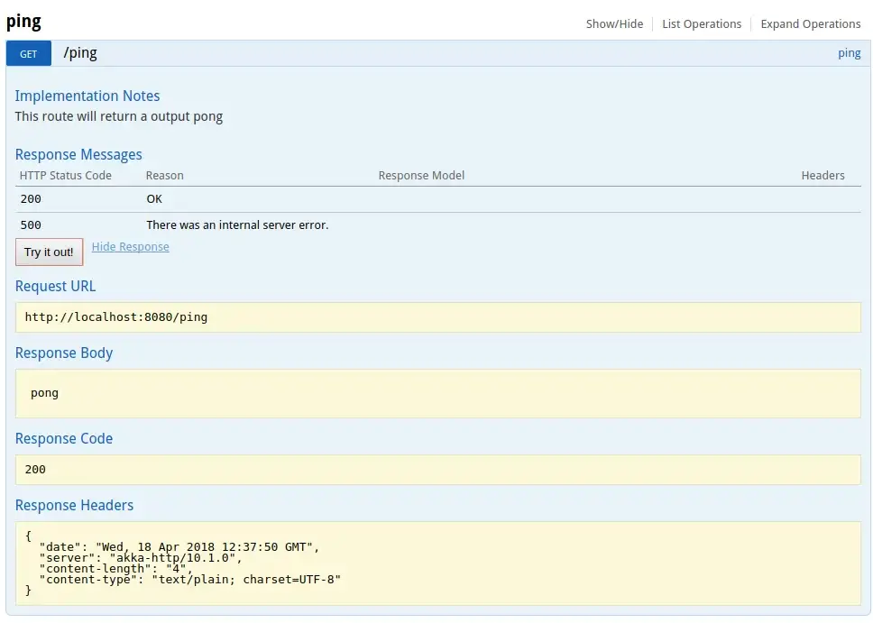
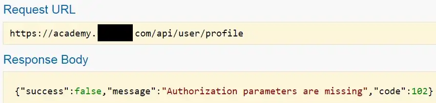

Hey everyone, I’d like to share how I found a simple API authorization bug in a private program, which affected thousands of sub-domains and allowed me to exploit a plethora of unprotected functionality without user interaction, from account deletion to takeovers and leaking limited information(Full name, e-mails ids and employer).

**Tl;dr**: The server wasn’t checking if the authorization bearer token belonged to a regular user or a poweruser.

It’s a private program, so some information will be redacted and I’ll refer to the site as “target.com”.

I had a dirsearch scan running in the background while skimming through
academy.target.com, to get an overview of the sites functionality.
I noticed an interesting endpoint like: academy.target.com/api/docs
Endpoints like these are a goldmine because they have API documentation and specify the structure of requests and responses.

On browsing to the endpoint, I found the page to be extremely similar to Swagger UI (this site didn’t use swagger though). It also had a button simply called “Authenticate”, and clicking on it navigated to a login page but it threw a “Account not authorized” message, if I tried logging in.

There were some interesting endpoints like:
- /poweruser/add
- /poweruser/delete
- /user/delete
- /user/create
- /user/user_logged_in
- /user/profile

This caught me off guard because it seemed like these endpoints should be reserved for internal/power users use only.
Directly calling the endpoints without any API token or authorization header resulted in:

The website didn’t seem to offer any API, and I couldn’t find any way to generate an API token, so I decided to check it out later.
After extensively searching the site, I still couldn’t find a single API token in the requests or the response.
However, I noticed many requests had an authorization bearer token.

I decided to simply copy the header and include it in the calls to the API endpoints I found.
I created another account and tried to change its password, with a **POST** request to **api/user/edit**.



  



Voilà! It worked like a charm. Apart from escalating my account to a power-user, I could successfully invoke almost all the other API endpoints.
The documentation detailed the parameters I needed to delete/take over/create new accounts and do some other bad things.

I decided to report the vulnerability directly to the vendor and it turned out they had a private bug bounty program and awarded me a $440 bounty.